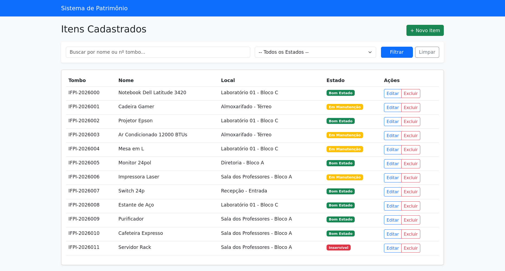
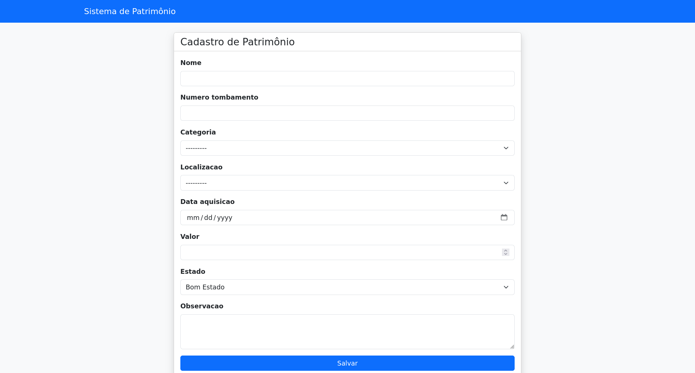
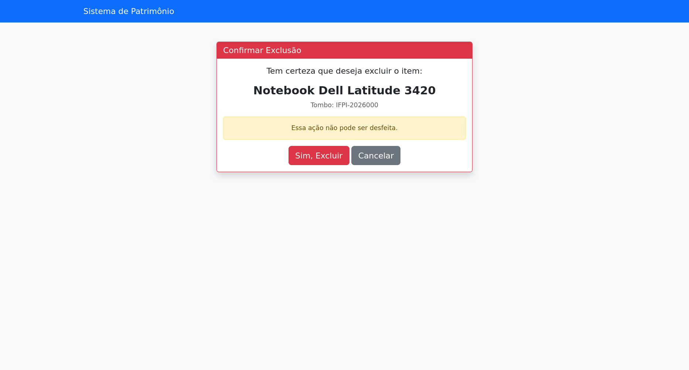
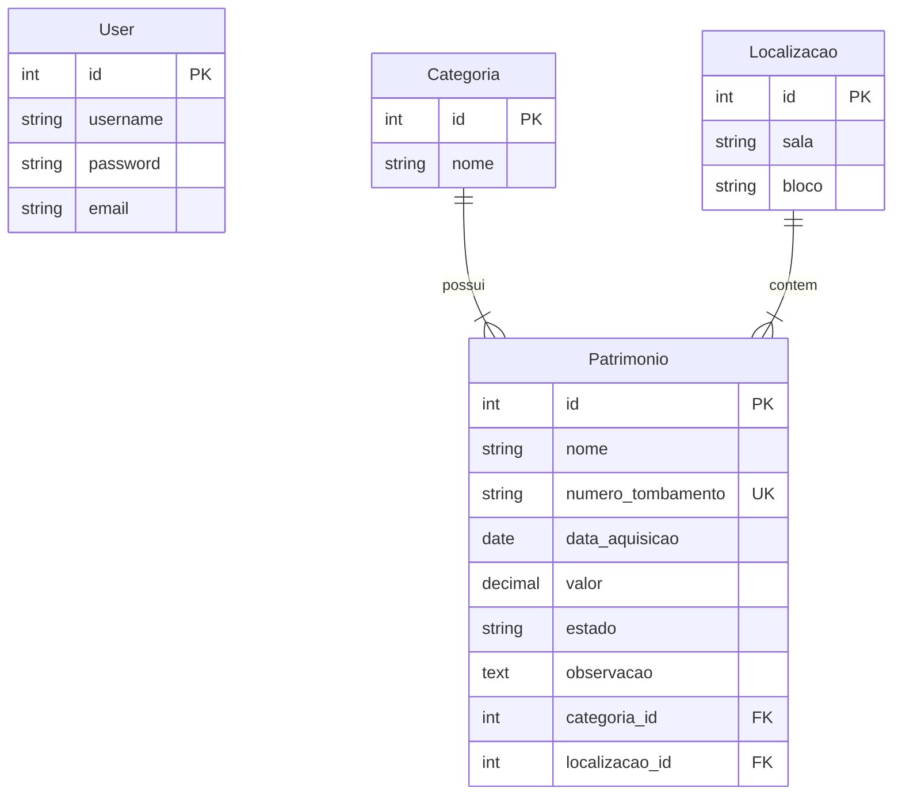

# Sistema de Controle de Patrimônio (MVP)

Sistema desenvolvido em **Python** e **Django** para o gerenciamento de ativos patrimoniais, trabalho acadêmico da matéria de Desenvolvimento Web 2. O projeto permite o cadastro, rastreamento de localização, categorização e controle do estado de conservação de bens (tombamento). 

## Funcionalidades

- **CRUD Completo:** Criação, Leitura, Atualização e Exclusão de itens patrimoniais.
- **Busca Inteligente:** Pesquisa simultânea por nome do item ou número de tombamento.
- **Filtros Avançados:** Filtragem rápida por estado de conservação (Bom, Manutenção, Inservível).
- **Interface Responsiva:** Utilização de **Bootstrap 5** para layout limpo e adaptável.
- **Data Seeder:** Script automatizado para povoar o banco de dados com dados fictícios para testes.
- **Painel Administrativo:** Gestão de Categorias e Localizações via Django Admin.

### Galeria do Projeto

| Tela Inicial | 
| :---: | 
|  | 

| Formulário de Cadastro | Confirmação de Exclusão | 
| :---: | :---: |
|  |  |


## Tecnologias Utilizadas

- **Backend:** Python 3.10+, Django 5.x
- **Frontend:** HTML5, CSS3, Bootstrap 5 (CDN)
- **Banco de Dados:** SQLite

## DER


## Como Rodar o Projeto Localmente

Siga os passos abaixo para configurar o ambiente de desenvolvimento.

### 1. Clone o repositório
```bash
git clone [https://github.com/seu-usuario/sistema-patrimonio.git](https://github.com/seu-usuario/sistema-patrimonio.git)
cd sistema-patrimonio
```
### 2. Crie e ative o ambiente virtual
```bash
python3 -m venv venv
source venv/bin/activate
```

### 3. Instale as dependências
```bash
pip install -r requirements.txt
```

### 4. Configure o Banco de Dados
```bash
python manage.py migrate
```

### 5. (Opcional) Povoe o banco com dados de teste
O projeto possui um comando personalizado para gerar dados de exemplo:
```bash
python manage.py seed
```

### 6. Crie um superusuário (para acessar o Admin)
```bash
python manage.py createsuperuser
```

### 7. Inicie o Servidor
```bash
python manage.py runserver
```
Acesse o sistema em: http://127.0.0.1:8000/

## Estrutura do Projeto
- **core/**: Aplicação principal contendo:

    - **models.py**: Definição de Patrimônio, Categoria e Localização.

    - **views.py**: Lógica de listagem, busca, edição e exclusão.

    - **management/commands/seed.py**: Script de povoamento do banco.

- **templates/**: Arquivos HTML renderizados pelo Django.

## Licença
Este projeto está sob a licença MIT. Sinta-se livre para usar e modificar.

Desenvolvido por Maria Fernanda Rodrigues Costa